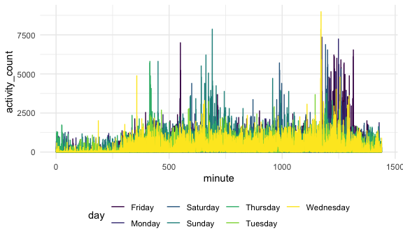
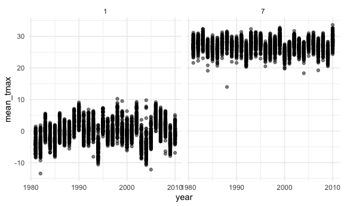
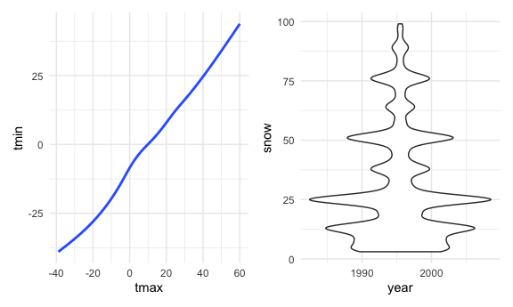

Homework 4
================
Maya Bunyan

This my solution to Homework 4\!

# Problem 1

Load instacart dataset.

``` r
data(instacart)
```

The dataset comes from the Instacart online grocery service. It includes
1384617 observations for 15 variables. These variables include the
order, user, and product ID. There is also information about the order
products were added to the cart, if the products were ordered by the
user before, as well as when the order was placed. Information regarding
the product, including the name, what aisle it is on, and what
department it is in. Each observation in the dataset includes this
information for one order for a given user.

How many aisles and which aisles are the most items ordered from?

``` r
instacart %>%
count(aisle) %>%
arrange(desc(n))
```

    ## # A tibble: 134 x 2
    ##    aisle                              n
    ##    <chr>                          <int>
    ##  1 fresh vegetables              150609
    ##  2 fresh fruits                  150473
    ##  3 packaged vegetables fruits     78493
    ##  4 yogurt                         55240
    ##  5 packaged cheese                41699
    ##  6 water seltzer sparkling water  36617
    ##  7 milk                           32644
    ##  8 chips pretzels                 31269
    ##  9 soy lactosefree                26240
    ## 10 bread                          23635
    ## # … with 124 more rows

Make a plot\!

``` r
instacart %>%
count(aisle) %>%
filter(n > 10000) %>%
mutate(
aisle = factor(aisle),
aisle = fct_reorder(aisle, n)
) %>%
ggplot(aes(x = aisle, y = n)) +
geom_point() +
theme(axis.text.x = element_text(angle = 90, vjust = 0.5, hjust = 1))
```


Table of three most popular items in given aisles.

``` r
instacart %>%
filter(aisle %in% c("baking ingredients", "dog food care", "packaged vegetables fruits")) %>%
group_by(aisle) %>%
count(product_name) %>%
mutate(rank = min_rank(desc(n))) %>%
filter(rank < 4) %>%
arrange(aisle, rank) %>%
knitr::kable()
```

| aisle                      | product\_name                                 |    n | rank |
| :------------------------- | :-------------------------------------------- | ---: | ---: |
| baking ingredients         | Light Brown Sugar                             |  499 |    1 |
| baking ingredients         | Pure Baking Soda                              |  387 |    2 |
| baking ingredients         | Cane Sugar                                    |  336 |    3 |
| dog food care              | Snack Sticks Chicken & Rice Recipe Dog Treats |   30 |    1 |
| dog food care              | Organix Chicken & Brown Rice Recipe           |   28 |    2 |
| dog food care              | Small Dog Biscuits                            |   26 |    3 |
| packaged vegetables fruits | Organic Baby Spinach                          | 9784 |    1 |
| packaged vegetables fruits | Organic Raspberries                           | 5546 |    2 |
| packaged vegetables fruits | Organic Blueberries                           | 4966 |    3 |

Table mean time Apples and Ice Cream were ordered.

``` r
instacart %>%
filter(product_name %in% c("Pink Lady Apples", "Coffee Ice Cream")) %>%
group_by(product_name, order_dow) %>%
summarize(mean_hour = mean(order_hour_of_day)) %>%
pivot_wider(
names_from = order_dow,
values_from = mean_hour
)
```

    ## `summarise()` regrouping output by 'product_name' (override with `.groups` argument)

    ## # A tibble: 2 x 8
    ## # Groups:   product_name [2]
    ##   product_name       `0`   `1`   `2`   `3`   `4`   `5`   `6`
    ##   <chr>            <dbl> <dbl> <dbl> <dbl> <dbl> <dbl> <dbl>
    ## 1 Coffee Ice Cream  13.8  14.3  15.4  15.3  15.2  12.3  13.8
    ## 2 Pink Lady Apples  13.4  11.4  11.7  14.2  11.6  12.8  11.9

## Problem 2

Load and tidy accel data.

``` r
accel_tidy_data =
  read_csv(
    "./accel_data.csv") %>%
  janitor::clean_names() %>%
  pivot_longer(
    activity_1:activity_1440,
    names_to = "minute",
    names_prefix = "activity_",
    values_to = "activity_count")%>%
  mutate(
    day = as.factor(day),
    minute = as.numeric(minute),
    week_day_end = ifelse(day == "Saturday" | day == "Sunday", "Weekdend", "Weekday")
  )
```

    ## Parsed with column specification:
    ## cols(
    ##   .default = col_double(),
    ##   day = col_character()
    ## )

    ## See spec(...) for full column specifications.

This dataset includes 50400 observations and `ncol(accel_tidy_data)`
variables. The variables include information on what week and day the
data is from, the day id, the minute of the day the activity was taking
place, as well as the count of the activity taking place in that minute.

Table total activity for day.

``` r
accel_tidy_data %>%
    mutate(
      day = factor(day, levels = c("Monday", "Tuesday", "Wednesday", "Thursday", "Friday", "Saturday", "Sunday"))
    ) %>%
   group_by(week, day) %>%
  summarize(total_activity = sum(activity_count))
```

    ## `summarise()` regrouping output by 'week' (override with `.groups` argument)

    ## # A tibble: 35 x 3
    ## # Groups:   week [5]
    ##     week day       total_activity
    ##    <dbl> <fct>              <dbl>
    ##  1     1 Monday            78828.
    ##  2     1 Tuesday          307094.
    ##  3     1 Wednesday        340115.
    ##  4     1 Thursday         355924.
    ##  5     1 Friday           480543.
    ##  6     1 Saturday         376254 
    ##  7     1 Sunday           631105 
    ##  8     2 Monday           295431 
    ##  9     2 Tuesday          423245 
    ## 10     2 Wednesday        440962 
    ## # … with 25 more rows

From the output table, I do not notice any trends in the total activity
counts.

Create plot activity over 24 hours.

``` r
accel_tidy_data %>%
  ggplot(aes(x = minute, y = activity_count, color = day, group_by(day_id))) +
  geom_line()
```



From the graph we are better able to see trends. We can see that there
are spikes in activity at certain parts of the day, specifically around
minute 500-800 and 1200-1400.

## Problem 3

Load the data.

``` r
data("ny_noaa")
```

Clean the dataset.

``` r
ny_noaa_tidy = 
  ny_noaa %>%
    separate(
    col = date, 
    into = c("year", "month", "day"),
    convert = TRUE) %>%
  mutate(
    tmax = as.numeric(tmax),
    tmax = tmax/10,
    tmin = as.numeric(tmin),
    tmin = tmin/10
  )

count = 
  ny_noaa_tidy %>% 
  count(snow) %>%
  arrange(desc(n))%>%
  mutate(rank = min_rank(desc(n))) %>%
  filter(rank < 4)
```

For snowfall, the most common values are 0 and NA. This makes sense
since there is no snowfall for most of the year in NY.

Create two-panel plot.

``` r
ny_noaa_tidy %>%
  select(id, month, year, tmax) %>%
  filter(month == 7 | month == 1) %>%
  group_by(id, month, year)%>%
  summarize(mean_tmax = mean(tmax, na.rm = TRUE)) %>%
  ggplot(aes(x = year, y = mean_tmax)) + 
  geom_point(alpha = 0.5) +
  facet_grid(~month) +
  theme(legend.position = "bottom")
```

    ## `summarise()` regrouping output by 'id', 'month' (override with `.groups` argument)

    ## Warning: Removed 5970 rows containing missing values (geom_point).



The mean max temps for January appears to be lower (between -20 and 10
C) than that of the mean max temps for July (between 20 and 40 C). We
see an outlier around 1982 in January and another around 2005. There
appears to be an outlier around 1988 in July.

``` r
tmax_tmin = 
  ny_noaa_tidy %>% 
  ggplot(aes(x = tmax, y = tmin)) + 
  geom_smooth(se = FALSE) +
  theme(legend.position = "bottom")

snow_dens = 
  ny_noaa_tidy %>% 
  filter(0 < snow & snow < 100) %>% 
  ggplot(aes(x = year, y = snow)) + 
  geom_violin(aes(fill = year)) + 
  theme(legend.position = "bottom")

tmax_tmin + snow_dens
```

    ## `geom_smooth()` using method = 'gam' and formula 'y ~ s(x, bs = "cs")'

    ## Warning: Removed 1136276 rows containing non-finite values (stat_smooth).


